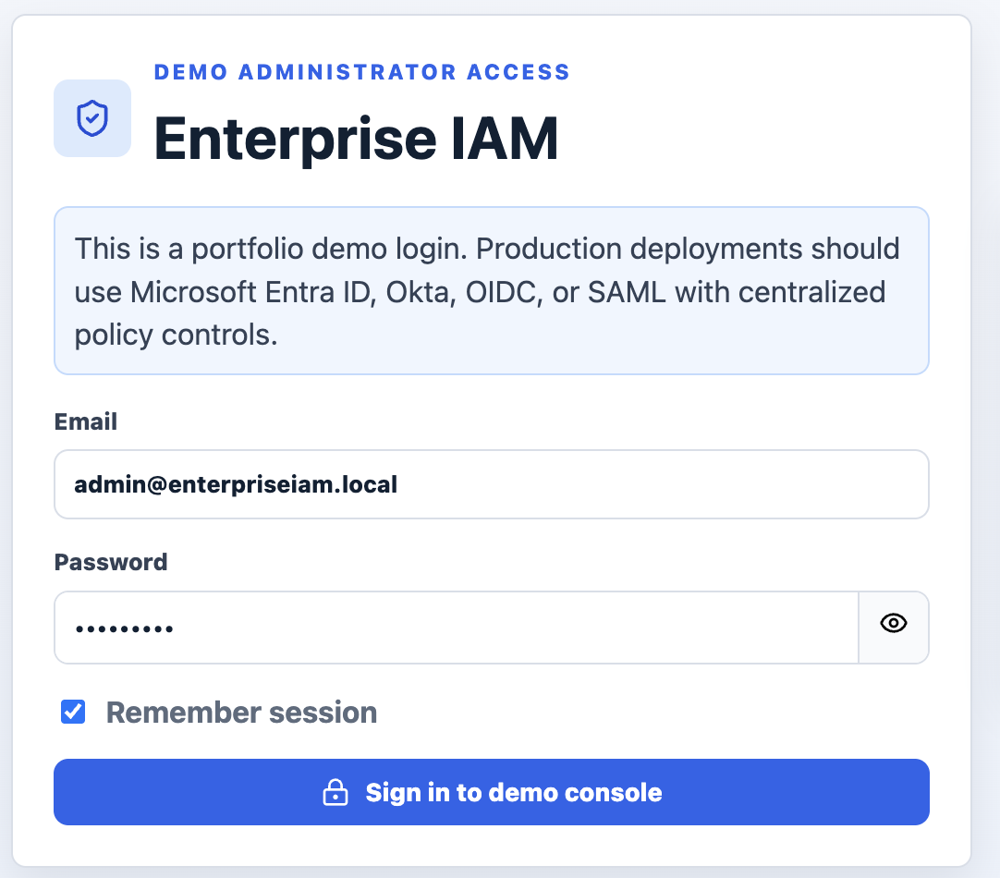
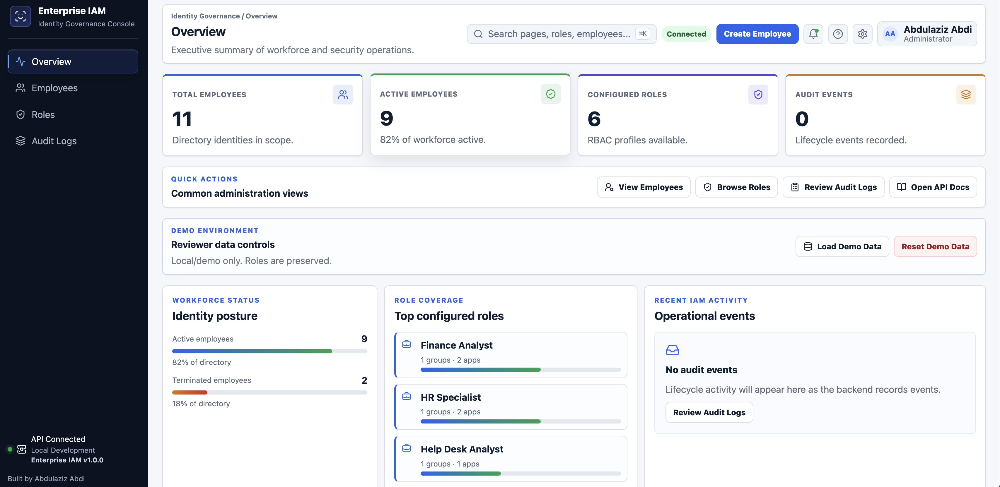
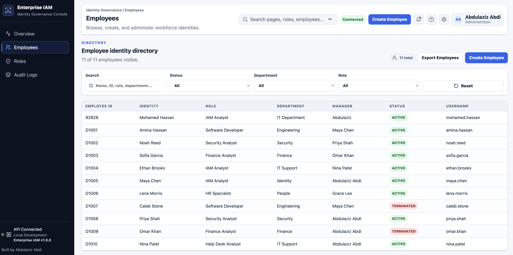
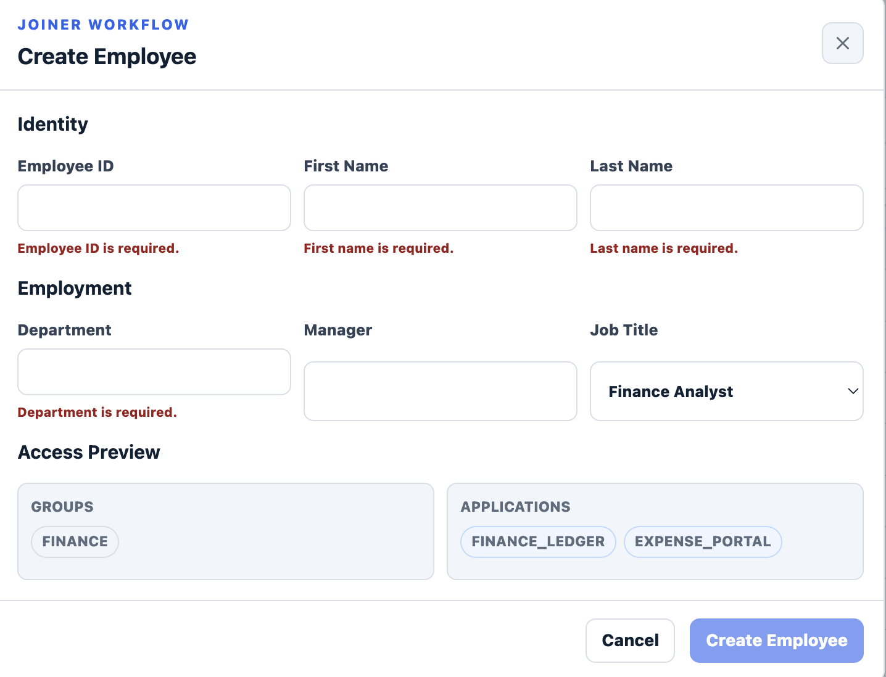
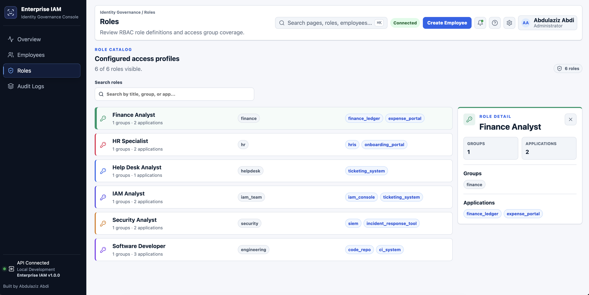
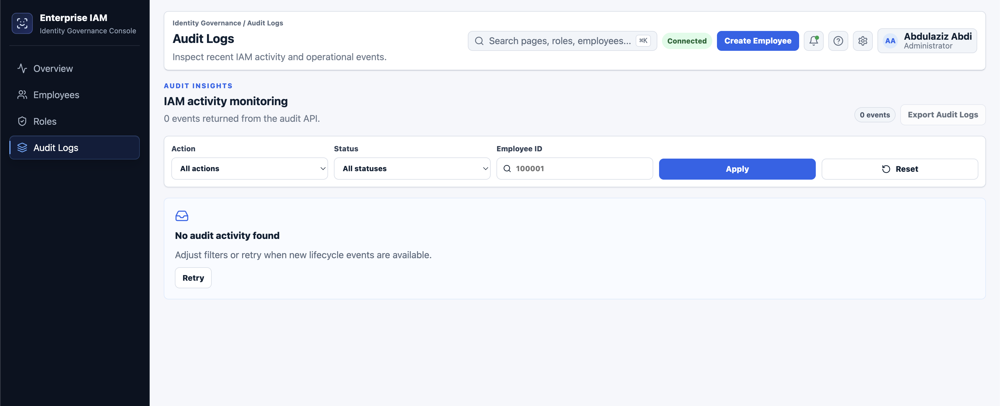

<div align="center">

# Enterprise IAM Platform

### Full-Stack Identity & Access Management (IAM) Platform

Production-style IAM platform demonstrating Joiner, Mover, and Leaver (JML) workflows, Role-Based Access Control (RBAC), workforce analytics, authentication, audit logging, and persistent identity provisioning.


</div>

<p align="center">
  
</p>

---

# Enterprise Overview

Enterprise IAM is a production-style Identity & Access Management platform that automates employee lifecycle management through **Joiner, Mover, and Leaver (JML)** workflows.

The application demonstrates enterprise IAM concepts including:

- Identity Lifecycle Management
- Role-Based Access Control (RBAC)
- Workforce Analytics
- Authentication
- Audit Logging
- Employee Provisioning
- Global Search
- Persistent Data Storage
- Dockerized Deployment
- CI/CD Automation

Designed as a portfolio project that mirrors common enterprise IAM administration platforms.

---

# ✨ Key Features

- ✅ Authentication
- ✅ Joiner (Employee Onboarding)
- ✅ Mover (Role Changes)
- ✅ Leaver (Employee Termination)
- ✅ Role-Based Access Control (RBAC)
- ✅ Employee Directory
- ✅ Employee Detail Drawer
- ✅ Workforce Analytics Dashboard
- ✅ Audit Logging
- ✅ Global Employee Search
- ✅ CSV Export
- ✅ SQLite Persistent Storage
- ✅ Docker Deployment
- ✅ GitHub Actions CI/CD
- ✅ 100+ Automated Backend Tests

---

# 📸 Screenshots

## Login

<p align="center">

</p>

---

## Dashboard

<p align="center">

</p>

---

## Employee Directory

<p align="center">

</p>

---

## Joiner Workflow

<p align="center">

</p>

---

## Mover Workflow

<p align="center">

</p>

---

## Audit Logs

<p align="center">

</p>

---

# 🏗 Architecture

```text
                    Browser
                        │
                        ▼
               React + Vite Frontend
                        │
                   REST API (HTTP)
                        ▼
                  FastAPI Backend
                        │
          ┌─────────────┼─────────────┐
          ▼             ▼             ▼
     IAM Service     Audit Logs    SQLite
                        │
                        ▼
                  Employee Records
```

---

# 🛠 Technology Stack

| Layer | Technology |
|--------|------------|
| Frontend | React • Vite |
| Backend | FastAPI |
| Database | SQLite |
| Authentication | Demo Authentication |
| Authorization | RBAC |
| Containerization | Docker |
| CI/CD | GitHub Actions |
| Testing | Pytest |
| API | REST |

---

# 📋 IAM Workflows

## Joiner

- Create employee identities
- Generate usernames
- Assign RBAC roles
- Provision security groups
- Provision applications

## Mover

- Change employee role
- Remove previous access
- Assign new access
- Preserve identity information
- Record audit events

## Leaver

- Disable employee
- Remove group memberships
- Remove application access
- Update lifecycle status
- Preserve audit history

---

# 🌐 REST API

| Method | Endpoint | Description |
|---------|----------|-------------|
| GET | `/employees` | List employees |
| GET | `/employees/{employee_id}` | Employee details |
| POST | `/employees` | Create employee |
| POST | `/employees/{employee_id}/move` | Change employee role |
| POST | `/employees/{employee_id}/terminate` | Terminate employee |
| GET | `/roles` | List RBAC roles |
| GET | `/audit-logs` | View audit events |

Business logic resides in **app/iam_service.py** while API routing is implemented in **app/main.py**.

---

# 💻 Frontend

The React administration console includes:

- Executive Dashboard
- Employee Directory
- Employee Detail Drawer
- Joiner Workflow
- Mover Workflow
- Leaver Workflow
- Role Catalog
- Audit Logs
- Global Search
- CSV Export
- Responsive UI
- Toast Notifications

Configure the frontend API:

```bash
VITE_API_BASE_URL=http://localhost:8000
```

---

# 🚀 Running Locally

Install backend dependencies

```bash
python3 -m pip install -r requirements.txt
```

Run FastAPI

```bash
uvicorn app.main:app --reload
```

Run React

```bash
cd frontend
npm install
npm run dev
```

Open:

- Frontend → http://localhost:5173
- API Documentation → http://localhost:8000/docs

---

# 🐳 Docker

Run both services:

```bash
docker compose up --build
```

Services:

- Frontend → http://localhost:3000
- Backend → http://localhost:8000

---

# ✅ Testing

Backend Tests

```bash
python3 -m pytest -q
```

Frontend Build

```bash
cd frontend
npm run build
```

Current Status

- ✅ 100+ Backend Tests Passing
- ✅ Production Frontend Build Passing
- ✅ GitHub Actions CI/CD Passing
- ✅ SQLite Persistence Verified

---

# ⚙️ Continuous Integration

GitHub Actions automatically executes on every Push and Pull Request.

Pipeline includes:

- Install Python dependencies
- Execute backend tests
- Install frontend dependencies
- Generate production React build

---

# 📁 Repository Structure

```text
enterprise-iam-lab/
├── app/
├── frontend/
├── tests/
├── docs/
├── data/
├── images/
├── Dockerfile
├── docker-compose.yml
├── requirements.txt
└── README.md
```

---

# 🚧 Future Enhancements

- [x] Joiner Workflow
- [x] Mover Workflow
- [x] Leaver Workflow
- [x] RBAC Provisioning
- [x] Authentication
- [x] Workforce Analytics
- [x] Audit Logging
- [x] Global Search
- [x] CSV Export
- [ ] Microsoft Entra ID Integration
- [ ] Okta Integration
- [ ] SCIM Provisioning
- [ ] Multi-Factor Authentication (MFA)
- [ ] Access Review Campaigns
- [ ] Approval Workflows
- [ ] Cloud Deployment (Azure/AWS)

---

# 👨‍💻 Author

**Abdulaziz Abdi**

- GitHub: https://github.com/Abdulaziz998
- LinkedIn: https://linkedin.com/in/abdulaziz-abdi

---

# 📄 License

Licensed under the MIT License.
